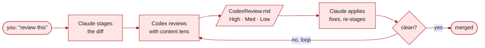

<a id="readme-top"></a>

<div align="center">

# anywhere-agents

**Your AI agents, configured once and running everywhere.**

A maintained, opinionated configuration for Claude Code and Codex that follows you across every project, every machine, every session.

[](https://pypi.org/project/anywhere-agents/)
[](https://www.npmjs.com/package/anywhere-agents)
[](https://anywhere-agents.readthedocs.io/)
[](LICENSE)
[](https://github.com/yzhao062/anywhere-agents/actions/workflows/validate.yml)
[](https://github.com/yzhao062/anywhere-agents)

[Install](#install) &nbsp;•&nbsp;
[Scenarios](#what-it-does-in-practice) &nbsp;•&nbsp;
[Docs](https://anywhere-agents.readthedocs.io) &nbsp;•&nbsp;
[Fork](#fork-and-customize)

</div>


> [!NOTE]
> **Condensed from daily use.** The sanitized public release of the agent config I have run daily since early 2026 across research, paper writing, and dev work (PyOD 3, LaTeX, admin) on macOS, Windows, and Linux. Not a weekend project. Maintained by [Yue Zhao](https://yzhao062.github.io) — USC CS faculty and author of [PyOD](https://github.com/yzhao062/pyod) (9.8k★ · 38M+ downloads · ~12k citations).

## Why you want this

You use AI coding agents across many projects. You have preferences — how reviews happen, what writing style to use, which Git operations must confirm, which AI-tell words to never emit. Today those preferences live in one of three broken states: scattered across per-repo `CLAUDE.md` files that drift over time, copy-pasted between projects diverging on every tweak, or only in your head — re-explained to every agent in every session.

`anywhere-agents` publishes one curated, maintained configuration that any project inherits in two lines of setup. The maintainer improves one file; every consuming repo picks it up on the next session. Four shipped skills cover review, routing, figures, and READMEs. Fork it, swap pieces, keep upstream updates.

## What it does in practice

Four concrete scenarios. These are what actually changes when you use `anywhere-agents`, not the features that describe it.

### A. Add to any project

Run this once in the project root:

```bash
pipx run anywhere-agents   # Python path (zero-install with pipx)
npx anywhere-agents        # Node.js path (zero-install with Node 14+)
```

Next time you open Claude Code or Codex here, the agent reads `AGENTS.md` automatically and inherits every default: writing style, Git safety, session checks, skill routing.

What appears in your project after bootstrap:

```text
your-project/
├── AGENTS.md              # shared config (synced from upstream)
├── AGENTS.local.md        # your per-project overrides (never overwritten)
├── .claude/
│   ├── commands/          # skill pointers — `implement-review`, `my-router`, `ci-mockup-figure`, `readme-polish`
│   └── settings.json      # your project keys merged with shared keys
└── .agent-config/         # upstream cache (auto-gitignored)
```

Git is the subscription engine. `git pull` gets updates. Fork and `git merge upstream/main` if you want to diverge.

### B. Review before you push

You finished a feature. You want a second opinion before the merge.

Ask Claude Code: **"review this"**.



`my-router` picks the skill (`implement-review`), which then picks the content lens (code, paper, proposal, or general) based on what you staged. Codex reads the diff, writes `CodexReview.md` with findings tagged **High / Medium / Low** and exact `file:line` references. Claude Code applies the fixes and re-stages — the loop runs until there is nothing left to flag.

### C. Writing that doesn't sound like an AI

You ask your agent to draft a related-work section. The default AI voice creeps in.

**Without `anywhere-agents`:**

> We <mark>delve</mark> into a <mark>pivotal</mark> realm — a <mark>multifaceted endeavor</mark> that <mark>underscores</mark> a <mark>paramount facet</mark> of outlier detection, <mark>paving the way</mark> for <mark>groundbreaking</mark> advances that will <mark>reimagine</mark> the <mark>trailblazing</mark> work of our predecessors and, in so doing, <mark>garner</mark> <mark>unprecedented</mark> attention in this <mark>burgeoning</mark> field.

_One sentence. 42 words. Ten highlighted AI-tell words. An em-dash used as casual punctuation. No structure — every clause just adds more filler._

**With `anywhere-agents`:**

> We examine outlier detection along three dimensions: coverage, interpretability, and scale. Each matters; none alone is sufficient. Prior work has addressed one or two of these in isolation; this work integrates all three.

_Three sentences. 33 words. Zero banned words. Semicolons and colons instead of em-dashes. One idea per sentence, and the last sentence actually says something about the contribution._

The shared `AGENTS.md` bans ~40 AI-tell words by default (`delve`, `pivotal`, `underscore`, `paramount`, `paving`, `groundbreaking`, `trailblazing`, `garner`, `unprecedented`, `burgeoning`, and more). It preserves your format (LaTeX stays LaTeX, no bullet conversion of prose), avoids em-dashes as casual punctuation, and does not glue a summary sentence to the end of every paragraph.

Customize the banned list in your fork, or override per project in `AGENTS.local.md`.

### D. Git safety catches mistakes before they happen

The agent is about to force-push main. You have had a long day and were about to type `y` without reading.

```text
[guard.py] ⛔ STOP! HAMMER TIME!

  command:   git push --force origin main
  category:  destructive push

This is destructive. Are you sure? (y/N)
```

Every destructive Git or GitHub command (`push --force`, `reset --hard`, `gh pr merge`, `git branch -D`, `git rebase`, and similar) goes through `guard.py`, a PreToolUse hook that refuses to proceed silently. Read-only operations (`status`, `diff`, `log`) stay fast.

Shell deletes (`rm -rf`) are gated separately through Claude Code's built-in permission prompts configured in `user/settings.json`.

## Install

> [!TIP]
> The simplest install is to tell your AI agent: _"Install anywhere-agents in this project."_ It will pick the right command from PyPI or npm.

```bash
# Python (zero-install with pipx)
pipx run anywhere-agents

# Node.js (zero-install with Node 14+)
npx anywhere-agents
```

### How to update

Bootstrap is idempotent. Every new agent session pulls the latest `AGENTS.md`, skills, and settings from upstream, so **you usually do not need to re-run the install command** — just start a new session in the project and the agent syncs as its first step.

To force a refresh mid-session (for example, when the maintainer just pushed a fix you need right now):

```bash
# macOS / Linux
bash .agent-config/bootstrap.sh

# Windows (PowerShell)
& .\.agent-config\bootstrap.ps1
```

To pin to a specific version, fork the repo and check out a tag in your fork, then point consumers at your fork instead of the main branch.

<details>
<summary><b>Raw shell (no package manager required)</b></summary>

macOS / Linux:

```bash
mkdir -p .agent-config
curl -sfL https://raw.githubusercontent.com/yzhao062/anywhere-agents/main/bootstrap/bootstrap.sh -o .agent-config/bootstrap.sh
bash .agent-config/bootstrap.sh
```

Windows (PowerShell):

```powershell
New-Item -ItemType Directory -Force -Path .agent-config | Out-Null
Invoke-WebRequest -UseBasicParsing -Uri https://raw.githubusercontent.com/yzhao062/anywhere-agents/main/bootstrap/bootstrap.ps1 -OutFile .agent-config/bootstrap.ps1
& .\.agent-config\bootstrap.ps1
```

</details>

Source: [PyPI](https://pypi.org/project/anywhere-agents/) · [npm](https://www.npmjs.com/package/anywhere-agents) · [bootstrap scripts](https://github.com/yzhao062/anywhere-agents/tree/main/bootstrap)

## Deeper docs

Full reference lives at **[anywhere-agents.readthedocs.io](https://anywhere-agents.readthedocs.io)**:

- Per-skill deep documentation (`implement-review`, `my-router`, `ci-mockup-figure`, `readme-polish`)
- `AGENTS.md` section-by-section reference
- Customization guide (fork, override, extend)
- FAQ, troubleshooting, platform notes (Windows, macOS, Linux)

## Fork and customize

Want to diverge — change writing defaults, add skills, swap the reviewer? Standard Git, no special tooling.

1. **Fork** `yzhao062/anywhere-agents` to your GitHub account.
2. **Edit:** `AGENTS.md`, `skills/<your-skill>/`, `skills/my-router/references/routing-table.md`.
3. **Repoint consumers** at your fork (change the URL in their bootstrap block).
4. **Pull upstream updates when you want them:**

    ```bash
    git remote add upstream https://github.com/yzhao062/anywhere-agents.git
    git fetch upstream
    git merge upstream/main   # resolve conflicts as usual
    ```

Git is the subscription engine. Cherry-pick what you want, skip what you do not.

<details>
<summary><b>Day-to-day usage</b></summary>

| Scenario | Do this |
|----------|---------|
| Add to a new project | Run any install command (`pipx run anywhere-agents`, `npx anywhere-agents`, or the raw shell) in the project root |
| Get latest updates | Start a new agent session — bootstrap runs automatically |
| Force refresh mid-session | `bash .agent-config/bootstrap.sh` (or `.ps1` on Windows) |
| Customize one project without touching upstream | Create `AGENTS.local.md` in the project root — never overwritten by sync |

</details>

<details>
<summary><b>What is opinionated and why</b></summary>

| Opinion | Why |
|---------|-----|
| **Safety-first by default** | `git commit` / `push` always confirm. Guard hook has no bypass mode. |
| **Dual-agent review is default** | Claude Code implements; Codex reviews. Either solo still works; the second opinion is where the value is. |
| **Strong writing style** | ~40 banned words, no em-dashes as casual punctuation, no bullet-conversion of prose, no summary sentence at the end of every paragraph. Sound like you, not a chatbot. |
| **Session checks report, not fix** | Flags outdated Actions versions, wrong Codex config, model preferences — agents never silently change anything without telling you. |

Disagree with any of this? Fork it and edit.

</details>

<details>
<summary><b>Repo layout</b></summary>

```text
anywhere-agents/
├── AGENTS.md                    # the opinionated configuration (curated defaults)
├── bootstrap/
│   ├── bootstrap.sh             # idempotent sync for macOS/Linux
│   └── bootstrap.ps1            # idempotent sync for Windows
├── scripts/
│   └── guard.py                 # PreToolUse hook: blocks destructive commands with loud warnings
├── skills/
│   ├── ci-mockup-figure/        # HTML mockups + TikZ/skia-canvas for papers, proposals, READMEs
│   ├── implement-review/        # structured dual-agent review loop (signature skill)
│   ├── my-router/               # context-aware skill dispatcher (extend with your own)
│   └── readme-polish/           # audit + rewrite GitHub READMEs with modern 2025-2026 patterns
├── .claude/
│   ├── commands/                # pointer files so Claude Code discovers the skills
│   └── settings.json            # project-level permissions
├── user/
│   └── settings.json            # user-level permissions, hook wiring, CLAUDE_CODE_EFFORT_LEVEL=max
├── docs/                        # README hero assets + Read the Docs source
├── tests/                       # bootstrap contract + smoke tests (Ubuntu + Windows CI)
└── .github/workflows/           # validation CI
```

</details>

<details>
<summary><b>Related projects</b></summary>

If you want a general-purpose multi-agent sync tool or a broader skill catalog, these take different approaches:

- [iannuttall/dotagents](https://github.com/iannuttall/dotagents) — central location for hooks, commands, skills, AGENTS/CLAUDE.md files
- [microsoft/agentrc](https://github.com/microsoft/agentrc) — repo-ready-for-AI tooling
- [agentfiles on PyPI](https://pypi.org/project/agentfiles/) — CLI that syncs configurations across multiple agents

`anywhere-agents` is intentionally narrower: a published, maintained, opinionated configuration — not a tool that manages configurations. Fork it if you like the setup; use one of the tools above if you want a universal manager.

</details>

<details>
<summary><b>What this is not</b></summary>

- Not a framework or CLI tool beyond the thin agent-friendly wrapper. No install step beyond the shell bootstrap. No YAML manifest.
- Not a universal multi-agent sync tool. Claude Code + Codex is the supported set. Other agents (Cursor, Aider, Gemini CLI) may work via the `AGENTS.md` convention but are not tested here.
- Not a marketplace or registry. One curated configuration, one maintainer.

</details>

<details>
<summary><b>Limitations and caveats</b></summary>

- Primary support is Claude Code + Codex. Cursor, Aider, Gemini CLI may work via `AGENTS.md` but are untested here.
- Requires `git` everywhere. Requires Python (stdlib only) for settings merge; bootstrap continues without merge if Python is unavailable.
- Guard hook deploys to `~/.claude/hooks/guard.py` and modifies `~/.claude/settings.json`. To opt out of user-level modifications, remove the user-level section from `bootstrap/bootstrap.sh` / `bootstrap/bootstrap.ps1` in your fork.

</details>

<details>
<summary><b>Maintenance and support</b></summary>

- **Maintained:** the author's daily-use workflow. Changes land when the author needs them.
- **Not maintained:** feature requests that do not match the author's work. Users should fork.
- **Best-effort:** bug reports, PRs for clear fixes, documentation improvements.

See [CONTRIBUTING.md](CONTRIBUTING.md) for how to propose changes.

</details>

## License

Apache 2.0. See [LICENSE](LICENSE).

<div align="center">

<a href="#readme-top">↑ back to top</a>

</div>
