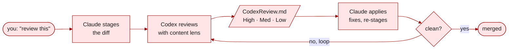

<a id="readme-top"></a>

<div align="center">

**English · [中文](README.zh-CN.md)**

# anywhere-agents

**One config to rule all your AI agents: portable, effective, safer.**

A maintained, opinionated configuration that follows you across every project, every machine, every session. Supports Claude Code and Codex today, with plans to grow.

[](https://pypi.org/project/anywhere-agents/)
[](https://www.npmjs.com/package/anywhere-agents)
[](https://anywhere-agents.readthedocs.io/)
[](LICENSE)
[](https://github.com/yzhao062/anywhere-agents/actions/workflows/validate.yml)
[](https://github.com/yzhao062/anywhere-agents)

[Install](#install) &nbsp;•&nbsp;
[Scenarios](#what-it-does-in-practice) &nbsp;•&nbsp;
[Docs](https://anywhere-agents.readthedocs.io) &nbsp;•&nbsp;
[Fork](#fork-and-customize)

</div>


> [!NOTE]
> **Condensed from daily use.** The sanitized public release of the agent config I have run daily since early 2026 across research, paper writing, and dev work (PyOD 3, LaTeX, admin) on macOS, Windows, and Linux. Not a weekend project. Maintained by [Yue Zhao](https://yzhao062.github.io) — USC CS faculty and author of [PyOD](https://github.com/yzhao062/pyod) (9.8k★ · 38M+ downloads · ~12k citations).

## Why you want this

Your preferences for how AI agents work (how reviews happen, what writing style to use, which Git operations must confirm, which AI-tell words to never emit) today live in one of three broken states: scattered across per-repo `CLAUDE.md` files that drift over time, copy-pasted between projects diverging on every tweak, or only in your head and re-explained to every agent in every session.

I started using Claude Code and Codex daily across research code, paper writing, and admin work in early 2026. Daily use exposed which rules actually needed automation: a bootstrap that syncs config across repos and machines; a review workflow that stages a diff, sends it to Codex, iterates; and a set of rules that kept failing at the prompt level until they became hooks or checks. `anywhere-agents` ships that (portable sync, review workflow, and mechanical enforcement) as one maintained configuration. Five shipped skills (`implement-review`, `my-router`, `ci-mockup-figure`, `readme-polish`, `code-release`) cover review, routing, figures, READMEs, and pre-release auditing. Fork it, swap pieces, keep upstream updates.

It is not only a style guide: hooks stop risky commands from proceeding silently and block flagged prose writes before they land.

## What it does in practice

A typical day with this config: morning project setup (Scenario A), midday review when a feature is done (Scenario B), afternoon prose drafting with writing-style guardrails (Scenario C), evening safety check before pushing (Scenario D), and session defaults at the right effort and model level running in the background (Scenario E). The five scenarios below are not a feature list; they are the default behavior the author has lived with since early 2026.

### A. Add to any project

Run this once in the project root:

```bash
pipx run anywhere-agents   # Python path (zero-install with pipx)
npx anywhere-agents        # Node.js path (zero-install with Node 14+)
```

Next time you open Claude Code or Codex here, the agent reads `AGENTS.md` automatically and inherits every default: writing style, Git safety, session checks, skill routing.

What appears in your project after bootstrap:

```text
your-project/
├── AGENTS.md              # shared config (synced from upstream)
├── AGENTS.local.md        # your per-project overrides (optional, never overwritten)
├── CLAUDE.md              # generated from AGENTS.md for Claude Code
├── agents/codex.md        # generated from AGENTS.md for Codex
├── .claude/
│   ├── commands/          # skill pointers: `implement-review`, `my-router`, `ci-mockup-figure`, `readme-polish`, `code-release`
│   └── settings.json      # your project keys merged with shared keys
└── .agent-config/         # upstream cache (auto-gitignored)
```

The composed `AGENTS.md` includes the [`agent-style`](https://github.com/yzhao062/agent-style) writing rule pack by default (21 rules covering banned AI-tell vocabulary, dash usage, and formatting). Rule packs are always-on content that lives inside `AGENTS.md`; skills are on-demand and live under `.claude/commands/`. Scenario F covers how to pin a version, swap the pack, or turn it off.

Git is the subscription engine. `git pull` gets updates. Fork and `git merge upstream/main` if you want to diverge.

### B. Review before you push

You finished a feature. You want a second opinion before the merge.

Ask Claude Code: **"review this"**.



`my-router` picks the skill (`implement-review`), which then picks the content lens (code, paper, proposal, or general) based on what you staged. Codex reads the diff, writes `CodexReview.md` with findings tagged **High / Medium / Low** and exact `file:line` references. Claude Code applies the fixes and re-stages — the loop runs until there is nothing left to flag. For larger changes, the loop can start with a plan-review phase that checks the approach before implementation.

### C. Writing that doesn't sound like an AI

You ask your agent to draft a related-work section. The default AI voice creeps in.

**Without `anywhere-agents`:**

> We <mark>delve</mark> into a <mark>pivotal</mark> realm — a <mark>multifaceted endeavor</mark> that <mark>underscores</mark> a <mark>paramount facet</mark> of outlier detection, <mark>paving the way</mark> for <mark>groundbreaking</mark> advances that will <mark>reimagine</mark> the <mark>trailblazing</mark> work of our predecessors and, in so doing, <mark>garner</mark> <mark>unprecedented</mark> attention in this <mark>burgeoning</mark> field.

_One sentence. 42 words. Ten highlighted AI-tell words. An em-dash used as casual punctuation. No structure — every clause just adds more filler._

**With `anywhere-agents`:**

> We examine outlier detection along three dimensions: coverage, interpretability, and scale. Each matters; none alone is sufficient. Prior work has addressed one or two of these in isolation; this work integrates all three.

_Three sentences. 33 words. Zero banned words. Semicolons and colons instead of em-dashes. One idea per sentence, and the last sentence actually says something about the contribution._

The shared `AGENTS.md` bans ~40 AI-tell words by default (`delve`, `pivotal`, `underscore`, `paramount`, `paving`, `groundbreaking`, `trailblazing`, `garner`, `unprecedented`, `burgeoning`, and more). It preserves your format (LaTeX stays LaTeX, no bullet conversion of prose), avoids em-dashes as casual punctuation, and does not glue a summary sentence to the end of every paragraph. The ban is enforced by a PreToolUse hook on `.md`/`.tex`/`.rst`/`.txt` writes; Scenario D covers the mechanism.

Customize the banned list in your fork, or override per project in `AGENTS.local.md`. The 21-rule `agent-style` pack ships enabled by default and extends these defaults; Scenario F covers how to swap, pin, or disable it.

### D. Mechanical enforcement

A PreToolUse hook (`scripts/guard.py`) runs before every agent tool call and intercepts four classes of action before they land.

**Family 1: Destructive Git / GitHub confirmations.** The agent is about to force-push main. You have had a long day and were about to type `y` without reading.

```text
[guard.py] ⛔ STOP! HAMMER TIME!

  command:   git push --force origin main
  category:  destructive push

This is destructive. Are you sure? (y/N)
```

Covers `git push`, `git commit`, `git merge`, `git rebase`, `git reset --hard`, `gh pr merge`, `gh pr create`, and related. Read-only operations (`status`, `diff`, `log`) stay fast.

**Family 2: Command-shape guard for compound `cd` chains.** `cd <path> && <cmd>` is denied at tool-call time because it triggers Claude Code's built-in approval prompts even when both halves are individually allowed, and hides the underlying tool call. Suggestion: use `git -C <path>` or pass the target path as an argument.

**Family 3: Writing-style deny on prose files.** Any `Write` / `Edit` / `MultiEdit` to `.md` / `.tex` / `.rst` / `.txt` files whose outgoing content contains a banned AI-tell word from `AGENTS.md` Writing Defaults is denied at tool-call time, not merely requested. The deny message lists the offending words so the agent can revise. Code files (`.py`, `.js`, etc.) are not checked.

**Family 4: Session-banner gate.** Until the agent has emitted the session-start banner at the top of a session, user-visible mutating tool calls (`Write` / `Edit` / `Bash` / `MultiEdit` / etc.) are denied; read-only and dispatch tools (`Read` / `Grep` / `Glob` / `Skill` / `Task` / `TodoWrite` and similar) stay available so the agent can inspect state and route work. Prevents silent skipping of the bootstrap status report.

`AGENT_CONFIG_GATES=off` in the `env` block of `~/.claude/settings.json` disables only Families 3 and 4. Families 1 and 2 stay on; they guard irreversible loss and hidden command shapes, with no false-positive cost worth the opt-out.

Shell deletes (`rm -rf`) are gated separately through Claude Code's built-in permission prompts configured in `user/settings.json`.

### E. The settings you did not know you were missing

Most Claude Code and Codex users never touch:

- **Effort level** — Claude Code defaults to `medium`. The `/effort` slider lets you pick `max`, but only for the current session; it does not persist.
- **Codex MCP config** — most users never open `~/.codex/config.toml` and run defaults that are slower and less capable than they need to be.
- **GitHub Actions pins** — workflows pinned at older majors still work today but will break when Node.js 20 is removed.
- **Banned AI-tell vocabulary** — prose comes out with `delve`, `pivotal`, `underscore` because nobody curates a project-level style guide.

You would have to read a dozen docs pages to discover these individually. `anywhere-agents` ships the recommended default stack in one install:

| Default | How it lands |
|---|---|
| `CLAUDE_CODE_EFFORT_LEVEL=max` persistent across every session | Merged into `~/.claude/settings.json` by bootstrap |
| Recommended Codex `config.toml` (`model = "gpt-5.4"`, `model_reasoning_effort = "xhigh"`, `service_tier = "fast"`) | Documented and verified by session-start check |
| `guard.py` PreToolUse hook intercepts destructive Git/GitHub commands (asks for confirmation), plus compound `cd` chains, writing-style banned words in prose files, and user-visible mutating tool calls before the session banner lands (all deny) | Deployed to `~/.claude/hooks/guard.py` |
| `session_bootstrap.py` SessionStart hook keeps the config fresh every session | Deployed to `~/.claude/hooks/session_bootstrap.py` |
| Session-start check flags outdated Actions pins, missing Codex config, and session model/effort below preference | Runs on every new session |


*Every session starts with this banner: current and latest versions of Claude Code and Codex (arrows appear only on drift), auto-update state, active skills, hooks, and any drift the session check found.*

Most users are running suboptimal defaults without knowing. This is the upgrade they did not look up.

### F. Swap or disable the writing rules

The writing discipline from Scenario C ships as the **`agent-style`** rule pack: an always-on instruction bundle composed into your `AGENTS.md` at bootstrap time, alongside the base configuration and the on-demand skills. Every bootstrap fetches `agent-style`'s canonical Markdown at a pinned git ref, validates it, and injects it inside a delimited block of the composed `AGENTS.md`.

```text
<!-- rule-pack:agent-style:begin version=v0.3.2 sha256=... -->
...agent-style rules body (21 rules)...
<!-- rule-pack:agent-style:end -->
```

**Composition is soft-dependency.** Rule-pack composition needs Python 3 + PyYAML. If PyYAML is missing, bootstrap attempts `pip install --user pyyaml` on your behalf; if Python or PyYAML still is not available, bootstrap writes the verbatim upstream `AGENTS.md` (no rule packs) plus a one-line tip. Bootstrap never hard-errors on missing dependencies.

**Opt out** — add `rule_packs: []` to `agent-config.yaml` at your project root and commit it:

```yaml
# agent-config.yaml
rule_packs: []
```

**Pin a version or swap the pack** — use an explicit `rule_packs:` list:

```yaml
# agent-config.yaml
rule_packs:
  - name: agent-style
    ref: v0.3.2       # optional; defaults to the manifest's default-ref
  # - name: your-fork-pack    # swap in your own, or add a second pack
```

`agent-config.local.yaml` (gitignored machine-local) overrides `agent-config.yaml` for per-developer experimentation; `AGENT_CONFIG_RULE_PACKS` env var adds transient packs for a single run without touching any file.

**Dry helper** — print the YAML snippet without running bootstrap:

```bash
bash .agent-config/bootstrap.sh --rule-packs agent-style
# PowerShell: & .\.agent-config\bootstrap.ps1 -RulePacks agent-style
```

For the full contract (manifest schema, cache + offline semantics, failure modes, routing-marker validation, how to register a second pack), see [`docs/rule-pack-composition.md`](docs/rule-pack-composition.md).

<details>
<summary><b>Historical naming: why the scratch directory is <code>.agent-config/</code></b></summary>

The consumer-repo scratch directory is called `.agent-config/`. The name is historical: it came from the private source repo `agent-config`, which was the original canonical source for the shared content. Consumers of `anywhere-agents` see the name `.agent-config/` even though they are using `anywhere-agents`, not the private source. New config files added by the rule-pack feature follow the same historical prefix for consistency: `agent-config.yaml` (tracked, at consumer repo root) and `agent-config.local.yaml` (gitignored, machine-local override).

A rename was considered and scoped during the rule-pack design (around 30 files / 292 occurrences across the repo plus a graceful-migration story for existing consumers). The cost-to-benefit did not pencil out at the project's current scale; the historical name stays.

</details>

## Install

> [!TIP]
> The simplest install is to tell your AI agent: _"Install anywhere-agents in this project."_ It will pick the right command from PyPI or npm.

```bash
# Python (zero-install with pipx)
pipx run anywhere-agents

# Node.js (zero-install with Node 14+)
npx anywhere-agents
```

### How to update

**For Claude Code, updates are automatic.** `anywhere-agents` installs a SessionStart hook that runs bootstrap every time you open a Claude Code session, so the shared `AGENTS.md`, skills, and settings stay fresh with no typing.

**For Codex or other agents** (no SessionStart hook support today), tell the agent in your first message of a session:

> `read @AGENTS.md to run bootstrap, session checks, and task routing`

This triggers the agent to read the bootstrap block in `AGENTS.md` and execute it. Same effect as the hook, one verbal invocation per session.

**To force a refresh mid-session** (for example, when the maintainer just pushed a fix you need right now):

```bash
# macOS / Linux
bash .agent-config/bootstrap.sh

# Windows (PowerShell)
& .\.agent-config\bootstrap.ps1
```

**To pin to a specific version**, fork the repo and check out a tag in your fork, then point consumers at your fork instead of the main branch.

<details>
<summary><b>Raw shell (no package manager required)</b></summary>

macOS / Linux:

```bash
mkdir -p .agent-config
curl -sfL https://raw.githubusercontent.com/yzhao062/anywhere-agents/main/bootstrap/bootstrap.sh -o .agent-config/bootstrap.sh
bash .agent-config/bootstrap.sh
```

Windows (PowerShell):

```powershell
New-Item -ItemType Directory -Force -Path .agent-config | Out-Null
Invoke-WebRequest -UseBasicParsing -Uri https://raw.githubusercontent.com/yzhao062/anywhere-agents/main/bootstrap/bootstrap.ps1 -OutFile .agent-config/bootstrap.ps1
& .\.agent-config\bootstrap.ps1
```

</details>

Source: [PyPI](https://pypi.org/project/anywhere-agents/) · [npm](https://www.npmjs.com/package/anywhere-agents) · [bootstrap scripts](https://github.com/yzhao062/anywhere-agents/tree/main/bootstrap)

## Deeper docs

Full reference lives at **[anywhere-agents.readthedocs.io](https://anywhere-agents.readthedocs.io)**:

- Per-skill deep documentation (`implement-review`, `my-router`, `ci-mockup-figure`, `readme-polish`, `code-release`)
- `AGENTS.md` section-by-section reference
- Customization guide (fork, override, extend)
- FAQ, troubleshooting, platform notes (Windows, macOS, Linux)

## Fork and customize

Want to diverge — change writing defaults, add skills, swap the reviewer? Standard Git, no special tooling.

1. **Fork** `yzhao062/anywhere-agents` to your GitHub account.
2. **Edit:** `AGENTS.md`, `skills/<your-skill>/`, `skills/my-router/references/routing-table.md`.
3. **Point consumers at your fork.** Pass your upstream as the bootstrap argv on first install:

    ```bash
    # Bash (macOS / Linux / Git Bash)
    curl -sfL https://raw.githubusercontent.com/<your-user>/<your-repo>/main/bootstrap/bootstrap.sh -o .agent-config/bootstrap.sh
    bash .agent-config/bootstrap.sh <your-user>/<your-repo>
    ```

    ```powershell
    # PowerShell (Windows)
    Invoke-WebRequest -UseBasicParsing -Uri https://raw.githubusercontent.com/<your-user>/<your-repo>/main/bootstrap/bootstrap.ps1 -OutFile .agent-config/bootstrap.ps1
    & .\.agent-config\bootstrap.ps1 <your-user>/<your-repo>
    ```

    Whichever value you pass (argv or `AGENT_CONFIG_UPSTREAM` env var) is persisted to `.agent-config/upstream` on that run, so later session-hook invocations pick it up automatically; you only pass it once per consumer project. Setting the env var on a later run updates the persisted value, so the env var can both seed and change the long-term upstream.

4. **Pull upstream updates when you want them:**

    ```bash
    git remote add upstream https://github.com/yzhao062/anywhere-agents.git
    git fetch upstream
    git merge upstream/main   # resolve conflicts as usual
    ```

Git is the subscription engine. Cherry-pick what you want, skip what you do not.

<details>
<summary><b>Day-to-day usage</b></summary>

| Scenario | Do this |
|----------|---------|
| Add to a new project | Run any install command (`pipx run anywhere-agents`, `npx anywhere-agents`, or the raw shell) in the project root |
| Get latest updates | Start a new agent session — bootstrap runs automatically |
| Force refresh mid-session | `bash .agent-config/bootstrap.sh` (or `.ps1` on Windows) |
| Customize one project without touching upstream | Create `AGENTS.local.md` in the project root — never overwritten by sync |

</details>

<details>
<summary><b>What is opinionated and why</b></summary>

| Opinion | Why |
|---------|-----|
| **Safety-first by default** | `git commit` / `push` always confirm. Destructive Git/GitHub (ask) and compound-command shapes (deny) have no bypass; writing-style and banner gates have an `AGENT_CONFIG_GATES=off` escape hatch for false positives. |
| **Dual-agent review is default** | Claude Code implements; Codex reviews. Either solo still works; the second opinion is where the value is. Includes an optional Phase 0 plan-review for complex work where the shape precedes the code. |
| **Strong writing style** | ~40 banned words (enforced by PreToolUse hook on `.md` / `.tex` / `.rst` / `.txt` writes), no em-dashes as casual punctuation, no bullet-conversion of prose, no summary sentence at the end of every paragraph. Sound like you, not a chatbot. |
| **Session checks report, not fix** | Flags outdated Actions versions, wrong Codex config, model preferences — agents never silently change anything without telling you. |

Disagree with any of this? Fork it and edit.

</details>

<details>
<summary><b>Repo layout</b></summary>

```text
anywhere-agents/
├── AGENTS.md                      # central source: tagged rule file (curated defaults)
├── CLAUDE.md                      # generated from AGENTS.md (Claude Code)
├── agents/
│   └── codex.md                   # generated from AGENTS.md (Codex)
├── bootstrap/
│   ├── bootstrap.sh               # idempotent sync for macOS/Linux
│   └── bootstrap.ps1              # idempotent sync for Windows
├── scripts/
│   ├── guard.py                   # PreToolUse hook: 4 gate families (dest-git/gh ask; compound cd / writing-style / banner deny)
│   ├── generate_agent_configs.py  # tag-based generator (AGENTS.md -> CLAUDE.md + codex.md)
│   ├── session_bootstrap.py       # SessionStart hook: runs bootstrap automatically
│   ├── pre-push-smoke.sh          # pre-push real-agent smoke (validates current checkout)
│   └── remote-smoke.sh            # post-publish real-agent smoke (validates published install)
├── skills/
│   ├── ci-mockup-figure/          # HTML mockups + TikZ/skia-canvas for figures
│   ├── code-release/              # pre-release audit checklist for research code repos
│   ├── implement-review/          # dual-agent review loop with Phase 0 plan-review (signature skill)
│   ├── my-router/                 # context-aware skill dispatcher
│   └── readme-polish/             # audit + rewrite GitHub READMEs with modern patterns
├── packages/
│   ├── pypi/                      # anywhere-agents PyPI CLI (pipx run anywhere-agents)
│   └── npm/                       # anywhere-agents npm CLI (npx anywhere-agents)
├── .claude/
│   ├── commands/                  # pointer files so Claude Code discovers the skills
│   └── settings.json              # project-level permissions
├── user/
│   └── settings.json              # user-level permissions, PreToolUse + SessionStart hooks, CLAUDE_CODE_EFFORT_LEVEL=max
├── docs/                          # Read the Docs source + README hero assets
├── tests/                         # bootstrap / guard / generator / session-bootstrap tests (Ubuntu + Windows + macOS CI, Python 3.9-3.13)
├── .github/workflows/             # validate, real-agent-smoke, package-smoke CI
├── .githooks/
│   └── pre-push                   # opt-in pre-push smoke (enable via `git config core.hooksPath .githooks`)
├── CHANGELOG.md
├── CONTRIBUTING.md
├── RELEASING.md
├── LICENSE
├── mkdocs.yml                     # Read the Docs config
└── .readthedocs.yaml
```

</details>

<details>
<summary><b>Related projects</b></summary>

If you want a general-purpose multi-agent sync tool or a broader skill catalog, these take different approaches:

- [iannuttall/dotagents](https://github.com/iannuttall/dotagents) — central location for hooks, commands, skills, AGENTS/CLAUDE.md files
- [microsoft/agentrc](https://github.com/microsoft/agentrc) — repo-ready-for-AI tooling
- [agentfiles on PyPI](https://pypi.org/project/agentfiles/) — CLI that syncs configurations across multiple agents

`anywhere-agents` is intentionally narrower: a published, maintained, opinionated configuration — not a tool that manages configurations. Fork it if you like the setup; use one of the tools above if you want a universal manager.

</details>

<details>
<summary><b>What this is not</b></summary>

- Not a framework or CLI tool beyond the thin agent-friendly wrapper. No install step beyond the shell bootstrap. No YAML manifest.
- Not a universal multi-agent sync tool. Claude Code + Codex is the supported set. Other agents (Cursor, Aider, Gemini CLI) may work via the `AGENTS.md` convention but are not tested here.
- Not a marketplace or registry. One curated configuration, one maintainer.

</details>

<details>
<summary><b>Limitations and caveats</b></summary>

- Primary support is Claude Code + Codex. Cursor, Aider, Gemini CLI may work via `AGENTS.md` but are untested here.
- Requires `git` everywhere. Requires Python (stdlib only) for settings merge; bootstrap continues without merge if Python is unavailable.
- Guard hook deploys to `~/.claude/hooks/guard.py` and modifies `~/.claude/settings.json`. To opt out of user-level modifications, remove the user-level section from `bootstrap/bootstrap.sh` / `bootstrap/bootstrap.ps1` in your fork.
- `AGENT_CONFIG_GATES=off` in the `env` block of `~/.claude/settings.json` disables only the writing-style and banner gates. Destructive Git/GitHub and compound-command guards stay active.

</details>

<details>
<summary><b>Maintenance and support</b></summary>

- **Maintained:** the author's daily-use workflow. Changes land when the author needs them.
- **Not maintained:** feature requests that do not match the author's work. Users should fork.
- **Best-effort:** bug reports, PRs for clear fixes, documentation improvements.

See [CONTRIBUTING.md](CONTRIBUTING.md) for how to propose changes.

</details>

## License

Apache 2.0. See [LICENSE](LICENSE).

<div align="center">

<a href="#readme-top">↑ back to top</a>

</div>
