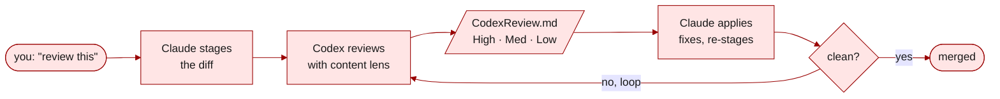

<a id="readme-top"></a>

<div align="center">

**[English](README.md) · 中文**

# anywhere-agents

**一份配置，统领所有 AI 智能体：可移植、有效、更安全。**

一套维护中的有主见配置，跨项目、跨机器、跨会话随你而行。当前支持 Claude Code 和 Codex，计划扩展更多。

[](https://pypi.org/project/anywhere-agents/)
[](https://www.npmjs.com/package/anywhere-agents)
[](https://anywhere-agents.readthedocs.io/)
[](LICENSE)
[](https://github.com/yzhao062/anywhere-agents/actions/workflows/validate.yml)
[](https://github.com/yzhao062/anywhere-agents)

[安装](#安装) &nbsp;·&nbsp;
[场景](#它在实战中做什么) &nbsp;·&nbsp;
[文档](https://anywhere-agents.readthedocs.io) &nbsp;·&nbsp;
[Fork](#fork-与定制)

</div>


> [!NOTE]
> **浓缩自日常使用。** 这是我自 2026 年初以来，在科研、论文写作和开发工作（PyOD 3、LaTeX、行政文书）中，跨 macOS、Windows、Linux 每天使用的智能体配置的脱敏公开版本。不是周末项目。由 [Yue Zhao](https://yzhao062.github.io) 维护——USC 计算机系教员，[PyOD](https://github.com/yzhao062/pyod) 作者（9.8k★ · 38M+ 下载 · ~12k 研究引用）。

## 为什么你需要它

你对 AI 智能体行为的偏好（如何进行代码审查、采用什么写作风格、哪些 Git 操作必须确认、哪些"AI 味儿"的词永远不要输出）如今通常以以下三种破碎状态之一存在：散落在各个仓库的 `CLAUDE.md` 文件里，日久偏移；从一个项目复制粘贴到另一个，每次微调都产生分叉；或者只在你脑子里，每个会话对每个智能体重新解释一次。

我从 2026 年初开始每天在科研代码、论文写作、行政工作中使用 Claude Code 与 Codex。日常使用让哪些规则真正需要自动化变得清晰：一个在仓库和机器间同步配置的 bootstrap；一个把 diff 交给 Codex 审查并循环迭代的审查工作流；以及一批在提示层面反复失败、最终变成钩子或检查的规则。`anywhere-agents` 把这三件事（可移植同步、审查工作流、机械化执行）作为一份维护中的配置一起发布。五个内置技能（`implement-review`、`my-router`、`ci-mockup-figure`、`readme-polish`、`code-release`）覆盖审查、路由、图表、README、发布前审计。Fork 它，替换部件，保留上游更新。

它不止是风格指南：钩子会阻止有风险的命令悄悄执行，并在落盘前拦下含被禁用词的散文写入。

## 它在实战中做什么

在这套配置下典型的一天：清晨启动项目（场景 A），午间功能做完后做 review（场景 B），下午带写作风格护栏写散文（场景 C），晚间推送前做安全检查（场景 D），以及在背景里把 effort 和模型维持在合适水平的会话默认（场景 E）。下面这五个场景不是功能列表，而是作者自 2026 年初以来每天的默认行为。

### A. 加入任何项目

在项目根目录运行一次：

```bash
pipx run anywhere-agents   # Python path (zero-install with pipx)
npx anywhere-agents        # Node.js path (zero-install with Node 14+)
```

下次在这里打开 Claude Code 或 Codex 时，智能体自动读取 `AGENTS.md`，继承全部默认设置：写作风格、Git 安全、会话启动检查、技能路由。

bootstrap 后项目中出现的东西：

```text
your-project/
├── AGENTS.md              # shared config (synced from upstream)
├── AGENTS.local.md        # your per-project overrides (optional, never overwritten)
├── CLAUDE.md              # generated from AGENTS.md for Claude Code
├── agents/codex.md        # generated from AGENTS.md for Codex
├── .claude/
│   ├── commands/          # skill pointers: `implement-review`, `my-router`, `ci-mockup-figure`, `readme-polish`, `code-release`
│   └── settings.json      # your project keys merged with shared keys
└── .agent-config/         # upstream cache (auto-gitignored)
```

Git 就是订阅引擎。`git pull` 拉取更新。要分叉，就 Fork 并 `git merge upstream/main`。

### B. 推送前先审查

你刚完成一个功能，想在合并前拿到第二双眼睛。

告诉 Claude Code：**"review this"**。



`my-router` 选技能（`implement-review`），该技能再根据你 stage 的内容选择审查视角（代码、论文、proposal、通用）。Codex 读取 diff，写入 `CodexReview.md`，发现的问题按 **High / Medium / Low** 打标签并给出精确的 `file:line` 引用。Claude Code 应用修复并重新 stage——循环一直跑到没有新发现为止。对于更大的变更，审查循环可以从 plan-review 阶段开始：先检查思路，再写代码。

### C. 写出像人的文字，不像 AI

你让智能体起草一个 related-work 章节。默认的 AI 腔就冒出来了。

**不用 `anywhere-agents`：**

> We <mark>delve</mark> into a <mark>pivotal</mark> realm — a <mark>multifaceted endeavor</mark> that <mark>underscores</mark> a <mark>paramount facet</mark> of outlier detection, <mark>paving the way</mark> for <mark>groundbreaking</mark> advances that will <mark>reimagine</mark> the <mark>trailblazing</mark> work of our predecessors and, in so doing, <mark>garner</mark> <mark>unprecedented</mark> attention in this <mark>burgeoning</mark> field.

_一句话，42 个词，十个高亮的"AI 味儿"词。破折号当日常标点用。没结构——每一分句只是在堆砌填充。_

**用了 `anywhere-agents`：**

> We examine outlier detection along three dimensions: coverage, interpretability, and scale. Each matters; none alone is sufficient. Prior work has addressed one or two of these in isolation; this work integrates all three.

_三句话，33 个词。零禁用词。用分号和冒号代替破折号。一句话一个想法，最后一句真的说出了贡献。_

共享的 `AGENTS.md` 默认禁用约 40 个"AI 味儿"词（`delve`、`pivotal`、`underscore`、`paramount`、`paving`、`groundbreaking`、`trailblazing`、`garner`、`unprecedented`、`burgeoning` 等）。它保留你的格式（LaTeX 保持 LaTeX、不把散文转换成项目符号），避免把破折号当日常标点，不给每段尾部硬塞一句总结。这些禁用词通过 PreToolUse 钩子在对 `.md`/`.tex`/`.rst`/`.txt` 的写入时强制执行；场景 D 讲机制。

在你的 fork 中定制禁用词表，或在 `AGENTS.local.md` 中对单项目覆盖。

### D. 机械化执行

`scripts/guard.py` 这个 PreToolUse 钩子在每次智能体 tool call 之前运行，拦截四类操作。

**第一族：破坏性 Git / GitHub 命令的二次确认。** 智能体正要 force-push main。你一天下来累了，差点不读就敲 `y`。

```text
[guard.py] ⛔ STOP! HAMMER TIME!

  command:   git push --force origin main
  category:  destructive push

This is destructive. Are you sure? (y/N)
```

覆盖 `git push`、`git commit`、`git merge`、`git rebase`、`git reset --hard`、`gh pr merge`、`gh pr create` 等。只读操作（`status`、`diff`、`log`）保持快速无拦截。

**第二族：复合 `cd` 命令的形状守护。** `cd <path> && <cmd>` 在 tool-call 时被拒，因为它会触发 Claude Code 内建的确认提示（即使两半命令单独都被允许），并掩盖实际要跑的调用。建议改用 `git -C <path>` 或把目标路径作为参数传入。

**第三族：散文文件的写作风格 deny。** 任何对 `.md` / `.tex` / `.rst` / `.txt` 的 `Write` / `Edit` / `MultiEdit`，如果输出内容包含 `AGENTS.md` Writing Defaults 中的禁用词，会在 tool-call 时被拒，而不只是"请重写"。拒绝消息会列出命中的词，让智能体自行修订。代码文件（`.py`、`.js` 等）不检查。

**第四族：会话启动横幅闸门。** 在智能体发出会话开头那个横幅之前，用户可见的变更类 tool call（`Write` / `Edit` / `Bash` / `MultiEdit` 等）会被拒；只读和调度类工具（`Read` / `Grep` / `Glob` / `Skill` / `Task` / `TodoWrite` 等）保持可用，智能体仍可以查看状态、路由任务。防止静默跳过 bootstrap 状态报告。

在 `~/.claude/settings.json` 的 `env` 块设 `AGENT_CONFIG_GATES=off` 只关闭第三、第四族。第一、第二族保持启用；它们守护的是不可逆损失和被隐藏的命令形状，没有值得 opt-out 的误伤成本。

Shell 删除（`rm -rf`）走的是 Claude Code 内建的权限提示，配置在 `user/settings.json` 里。

### E. 你不知道自己在缺什么的那些设置

大多数 Claude Code 和 Codex 用户从来不动：

- **Effort 等级**——Claude Code 默认 `medium`。`/effort` 滑块允许选 `max`，但只对当前会话有效，不持久化。
- **Codex MCP 配置**——大多数用户从不打开 `~/.codex/config.toml`，跑的都是比实际能用的更慢、能力更弱的默认值。
- **GitHub Actions 版本锁定**——停留在旧 major 的 workflow 今天还能跑，等 Node.js 20 被下线就会坏。
- **禁用的"AI 味儿"词库**——没人为项目策划一份风格指南，所以 prose 里就总冒出 `delve`、`pivotal`、`underscore`。

要逐条了解这些，你得读十几页文档。`anywhere-agents` 一次安装就配齐推荐的默认栈：

| 默认值 | 如何落地 |
|---|---|
| `CLAUDE_CODE_EFFORT_LEVEL=max` 跨会话持久化 | bootstrap 合并进 `~/.claude/settings.json` |
| 推荐的 Codex `config.toml`（`model = "gpt-5.4"`、`model_reasoning_effort = "xhigh"`、`service_tier = "fast"`） | 有文档说明，由会话启动检查验证 |
| `guard.py` PreToolUse 钩子拦截破坏性 Git/GitHub 命令（请求确认），以及复合 `cd` 命令、散文文件的禁用词写入、横幅发布前的用户可见变更类 tool call（后三者 deny） | 部署到 `~/.claude/hooks/guard.py` |
| `session_bootstrap.py` SessionStart 钩子保证每次会话配置最新 | 部署到 `~/.claude/hooks/session_bootstrap.py` |
| 会话启动检查标记过时的 Actions 版本锁定、缺失的 Codex 配置、低于偏好的会话模型/effort | 在每次新会话运行 |


*每次会话都以这个横幅开头：Claude Code 与 Codex 的当前版本和最新版本（仅在版本不一致时显示箭头）、自动更新状态、启用的技能、钩子，以及会话启动检查发现的任何偏移。*

大多数人正在用次优的默认设置，自己还不知道。这是他们没去查的那份升级。

## 安装

> [!TIP]
> 最简单的安装方式是告诉你的 AI 智能体：_"Install anywhere-agents in this project."_ 它会从 PyPI 或 npm 中选对命令。

```bash
# Python (zero-install with pipx)
pipx run anywhere-agents

# Node.js (zero-install with Node 14+)
npx anywhere-agents
```

### 如何更新

**对 Claude Code 而言，更新全自动。** `anywhere-agents` 安装一个 SessionStart 钩子，每次打开 Claude Code 会话时都跑一遍 bootstrap，所以共享的 `AGENTS.md`、技能、设置都保持最新，完全不需要你敲字。

**对 Codex 或其他智能体**（目前都不支持 SessionStart 钩子），在每次会话的第一条消息告诉智能体：

> `read @AGENTS.md to run bootstrap, session checks, and task routing`

这会让智能体读取 `AGENTS.md` 里的 bootstrap 块并执行。效果和钩子一样，只是每次会话要口头触发一次。

**会话中强制刷新**（比如维护者刚推了你现在需要的修复）：

```bash
# macOS / Linux
bash .agent-config/bootstrap.sh

# Windows (PowerShell)
& .\.agent-config\bootstrap.ps1
```

**要锁定到特定版本**，在你的 fork 里 checkout 一个 tag，然后让消费者指向你的 fork 而不是 main 分支。

<details>
<summary><b>原始 Shell（不需要任何包管理器）</b></summary>

macOS / Linux:

```bash
mkdir -p .agent-config
curl -sfL https://raw.githubusercontent.com/yzhao062/anywhere-agents/main/bootstrap/bootstrap.sh -o .agent-config/bootstrap.sh
bash .agent-config/bootstrap.sh
```

Windows (PowerShell):

```powershell
New-Item -ItemType Directory -Force -Path .agent-config | Out-Null
Invoke-WebRequest -UseBasicParsing -Uri https://raw.githubusercontent.com/yzhao062/anywhere-agents/main/bootstrap/bootstrap.ps1 -OutFile .agent-config/bootstrap.ps1
& .\.agent-config\bootstrap.ps1
```

</details>

来源：[PyPI](https://pypi.org/project/anywhere-agents/) · [npm](https://www.npmjs.com/package/anywhere-agents) · [bootstrap 脚本](https://github.com/yzhao062/anywhere-agents/tree/main/bootstrap)

## 更深入的文档

完整参考见 **[anywhere-agents.readthedocs.io](https://anywhere-agents.readthedocs.io)**：

- 每个技能的深度文档（`implement-review`、`my-router`、`ci-mockup-figure`、`readme-polish`、`code-release`）
- `AGENTS.md` 分节参考
- 定制指南（fork、覆盖、扩展）
- FAQ、故障排除、平台说明（Windows、macOS、Linux）

## Fork 与定制

想要分叉——改写作默认、加自己的技能、换审查者？标准 Git 流程，没有特殊工具。

1. 把 `yzhao062/anywhere-agents` **Fork** 到你的 GitHub 账号。
2. **编辑**：`AGENTS.md`、`skills/<your-skill>/`、`skills/my-router/references/routing-table.md`。
3. **把消费者指向你的 fork。** 在首次安装时把你的 upstream 作为 bootstrap 参数传入：

    ```bash
    # Bash (macOS / Linux / Git Bash)
    curl -sfL https://raw.githubusercontent.com/<your-user>/<your-repo>/main/bootstrap/bootstrap.sh -o .agent-config/bootstrap.sh
    bash .agent-config/bootstrap.sh <your-user>/<your-repo>
    ```

    ```powershell
    # PowerShell (Windows)
    Invoke-WebRequest -UseBasicParsing -Uri https://raw.githubusercontent.com/<your-user>/<your-repo>/main/bootstrap/bootstrap.ps1 -OutFile .agent-config/bootstrap.ps1
    & .\.agent-config\bootstrap.ps1 <your-user>/<your-repo>
    ```

    无论用哪种方式传（argv 或 `AGENT_CONFIG_UPSTREAM` 环境变量），这次运行都会把值写入 `.agent-config/upstream`；之后 session hook 触发的 bootstrap 会自动沿用，每个消费者项目只需传一次。后续运行中再设环境变量会更新这个持久化值，所以环境变量既能作为首次种子，也能作为长期上游切换。

4. **需要时拉取上游更新：**

    ```bash
    git remote add upstream https://github.com/yzhao062/anywhere-agents.git
    git fetch upstream
    git merge upstream/main   # resolve conflicts as usual
    ```

Git 就是订阅引擎。想要什么就 cherry-pick，不想要的就跳过。

<details>
<summary><b>日常使用</b></summary>

| 场景 | 这样做 |
|---|---|
| 加入新项目 | 在项目根目录运行任一安装命令（`pipx run anywhere-agents`、`npx anywhere-agents`，或原始 shell 命令） |
| 拿最新更新 | 开一个新的智能体会话——bootstrap 自动运行 |
| 会话中强制刷新 | `bash .agent-config/bootstrap.sh`（Windows 上用 `.ps1`） |
| 单项目定制而不动上游 | 在项目根目录创建 `AGENTS.local.md`——永不被同步覆写 |

</details>

<details>
<summary><b>哪些地方有主见，为什么</b></summary>

| 主见 | 为什么 |
|---|---|
| **默认安全优先** | `git commit` / `push` 一律二次确认。破坏性 Git/GitHub（ask）和复合命令形状（deny）没有绕过模式；写作风格和横幅 gate 另有 `AGENT_CONFIG_GATES=off` 开关用于误伤 edge case。 |
| **默认双智能体审查** | Claude Code 负责实现；Codex 负责审查。各自单独也能用；真正的价值在第二双眼睛。内置可选的 Phase 0 plan-review，用于结构先于代码的复杂任务。 |
| **强写作风格** | 约 40 个禁用词（由 PreToolUse 钩子在 `.md` / `.tex` / `.rst` / `.txt` 写入时强制执行），破折号不做日常标点，不把散文转成项目符号，不给每段尾巴硬塞总结。听起来像你，不像 chatbot。 |
| **会话检查报告，不自动修** | 标记过时的 Actions 版本、Codex 配置不对、模型偏好——智能体从不悄悄改东西不告诉你。 |

不同意任何一条？Fork 了改。

</details>

<details>
<summary><b>仓库结构</b></summary>

```text
anywhere-agents/
├── AGENTS.md                      # central source: tagged rule file (curated defaults)
├── CLAUDE.md                      # generated from AGENTS.md (Claude Code)
├── agents/
│   └── codex.md                   # generated from AGENTS.md (Codex)
├── bootstrap/
│   ├── bootstrap.sh               # idempotent sync for macOS/Linux
│   └── bootstrap.ps1              # idempotent sync for Windows
├── scripts/
│   ├── guard.py                   # PreToolUse hook: 4 gate families (dest-git/gh ask; compound cd / writing-style / banner deny)
│   ├── generate_agent_configs.py  # tag-based generator (AGENTS.md -> CLAUDE.md + codex.md)
│   ├── session_bootstrap.py       # SessionStart hook: runs bootstrap automatically
│   ├── pre-push-smoke.sh          # pre-push real-agent smoke (validates current checkout)
│   └── remote-smoke.sh            # post-publish real-agent smoke (validates published install)
├── skills/
│   ├── ci-mockup-figure/          # HTML mockups + TikZ/skia-canvas for figures
│   ├── code-release/              # pre-release audit checklist for research code repos
│   ├── implement-review/          # dual-agent review loop with Phase 0 plan-review (signature skill)
│   ├── my-router/                 # context-aware skill dispatcher
│   └── readme-polish/             # audit + rewrite GitHub READMEs with modern patterns
├── packages/
│   ├── pypi/                      # anywhere-agents PyPI CLI (pipx run anywhere-agents)
│   └── npm/                       # anywhere-agents npm CLI (npx anywhere-agents)
├── .claude/
│   ├── commands/                  # pointer files so Claude Code discovers the skills
│   └── settings.json              # project-level permissions
├── user/
│   └── settings.json              # user-level permissions, PreToolUse + SessionStart hooks, CLAUDE_CODE_EFFORT_LEVEL=max
├── docs/                          # Read the Docs source + README hero assets
├── tests/                         # bootstrap / guard / generator / session-bootstrap tests (Ubuntu + Windows + macOS CI, Python 3.9-3.13)
├── .github/workflows/             # validate, real-agent-smoke, package-smoke CI
├── .githooks/
│   └── pre-push                   # opt-in pre-push smoke (enable via `git config core.hooksPath .githooks`)
├── CHANGELOG.md
├── CONTRIBUTING.md
├── RELEASING.md
├── LICENSE
├── mkdocs.yml                     # Read the Docs config
└── .readthedocs.yaml
```

</details>

<details>
<summary><b>相关项目</b></summary>

如果你想要通用的多智能体同步工具或更广的技能目录，这些采用了不同思路：

- [iannuttall/dotagents](https://github.com/iannuttall/dotagents)——集中管理钩子、命令、技能、AGENTS/CLAUDE.md 文件
- [microsoft/agentrc](https://github.com/microsoft/agentrc)——让仓库对 AI 友好的工具链
- [agentfiles on PyPI](https://pypi.org/project/agentfiles/)——跨智能体同步配置的 CLI

`anywhere-agents` 的定位更窄：一份发布的、维护的、有主见的配置——不是管理配置的工具。如果喜欢这套设定，Fork 它；如果想要通用管理器，用上面任一。

</details>

<details>
<summary><b>它不是什么</b></summary>

- 不是框架或 CLI 工具（除了薄薄的对智能体友好的 wrapper）。除 shell bootstrap 之外没有额外安装步骤。没有 YAML manifest。
- 不是通用多智能体同步工具。Claude Code + Codex 才是支持的组合。其他智能体（Cursor、Aider、Gemini CLI）可能通过 `AGENTS.md` 约定工作，但未经在这里测试。
- 不是市场或注册中心。一份精选配置，一位维护者。

</details>

<details>
<summary><b>限制与注意事项</b></summary>

- 主要支持 Claude Code + Codex。Cursor、Aider、Gemini CLI 可能通过 `AGENTS.md` 工作，但未经在这里测试。
- 到处都需要 `git`。需要 Python（仅标准库）用于设置合并；若无 Python，bootstrap 会跳过合并继续运行。
- Guard 钩子会部署到 `~/.claude/hooks/guard.py` 并修改 `~/.claude/settings.json`。要放弃用户级修改，在你的 fork 的 `bootstrap/bootstrap.sh` / `bootstrap/bootstrap.ps1` 中删掉 user-level section。
- 在 `~/.claude/settings.json` 的 `env` 块设 `AGENT_CONFIG_GATES=off` 只关闭写作风格和横幅 gate。破坏性 Git/GitHub 和复合命令守护始终启用。

</details>

<details>
<summary><b>维护与支持</b></summary>

- **会维护：** 作者每天在用的工作流。作者需要什么就改什么。
- **不维护：** 和作者工作不匹配的功能请求。用户应该 fork。
- **尽力而为：** bug 报告、针对清晰修复的 PR、文档改进。

关于如何提议变更，见 [CONTRIBUTING.md](CONTRIBUTING.md)。

</details>

## 许可证

Apache 2.0。见 [LICENSE](LICENSE)。

<div align="center">

<a href="#readme-top">↑ 回到顶部</a>

</div>
