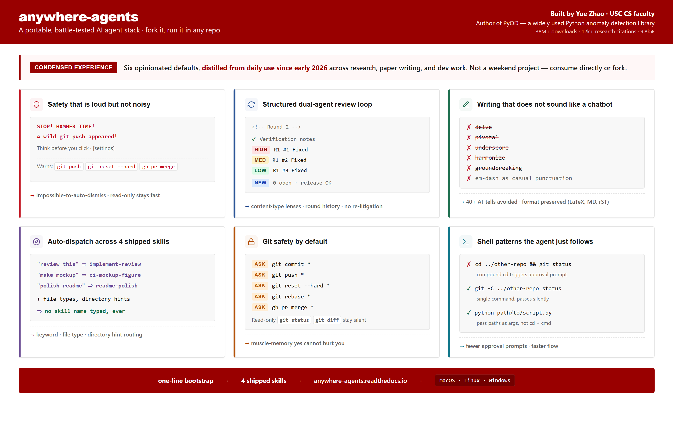

# anywhere-agents

<p align="center">
  
</p>

**One config to rule all your AI agents: portable, effective, safer.**

A maintained, opinionated configuration that follows you across every project, every machine, every session. Supports Claude Code and Codex today, with plans to grow.

This site is the motivated-reader reference. For the scenario-first quick start, see the [README on GitHub](https://github.com/yzhao062/anywhere-agents).

## What this site covers

- **[Install](install.md)** — PyPI, npm, raw shell. Prerequisites and troubleshooting.
- **[Rule packs](rule-pack-composition.md)** — the always-on instruction layer. Covers the default `agent-style` writing pack, opt-out, pin-a-version, and how to register a new pack.
- **[Skills](skills/index.md)** — deep documentation for the five shipped skills: `implement-review`, `my-router`, `ci-mockup-figure`, `readme-polish`, `code-release`.
- **[AGENTS.md reference](agents-md.md)** — section-by-section tour of the shared configuration.
- **[FAQ](faq.md)** — common questions and troubleshooting.
- **[Changelog](changelog.md)** — what has shipped and when.

## Quick install

=== "PyPI"

    ```bash
    pipx run anywhere-agents
    ```

=== "npm"

    ```bash
    npx anywhere-agents
    ```

=== "Raw shell (macOS / Linux)"

    ```bash
    mkdir -p .agent-config
    curl -sfL https://raw.githubusercontent.com/yzhao062/anywhere-agents/main/bootstrap/bootstrap.sh -o .agent-config/bootstrap.sh
    bash .agent-config/bootstrap.sh
    ```

=== "Raw shell (Windows)"

    ```powershell
    New-Item -ItemType Directory -Force -Path .agent-config | Out-Null
    Invoke-WebRequest -UseBasicParsing -Uri https://raw.githubusercontent.com/yzhao062/anywhere-agents/main/bootstrap/bootstrap.ps1 -OutFile .agent-config/bootstrap.ps1
    & .\.agent-config\bootstrap.ps1
    ```

Run the command once in the project root. Next time you open Claude Code or Codex there, the agent reads `AGENTS.md` automatically and inherits every default.

For more, see [Install](install.md).

## Who maintains this

Maintained by [Yue Zhao](https://yzhao062.github.io) — USC Computer Science faculty and author of [PyOD](https://github.com/yzhao062/pyod) (9.8k★, 38M+ downloads, ~12k research citations). This is the sanitized public release of the agent config used daily since early 2026 across research, paper writing, and dev work on macOS, Windows, and Linux.

## License

[Apache 2.0](https://github.com/yzhao062/anywhere-agents/blob/main/LICENSE).
