# Install

Every install path does the same thing: download the shell bootstrap and run it in the current directory. The bootstrap is idempotent — safe to run every session even if `.agent-config/` already exists.

```mermaid
flowchart LR
    A[You run<br/>install command] --> B[Download<br/>bootstrap.sh / .ps1]
    B --> C[Fetch upstream<br/>AGENTS.md]
    C --> D[Sparse-clone<br/>skills/ .claude/ scripts/ user/]
    D --> E[Copy skill pointers<br/>to .claude/commands/]
    E --> F[Merge shared<br/>settings into project]
    F --> G[Install guard.py<br/>to ~/.claude/hooks/]
    G --> H[Merge user settings<br/>into ~/.claude/]
    H --> I[Add .agent-config/<br/>to .gitignore]
    I --> J[Done — agent<br/>reads AGENTS.md]

    classDef step fill:#fff,stroke:#990000,stroke-width:1.5px,color:#990000;
    class A,B,C,D,E,F,G,H,I,J step;
```



## PyPI

Zero-install with pipx:

```bash
pipx run anywhere-agents
```

`pipx` handles the isolated environment; re-runs always fetch the latest version. Install `pipx` itself via [pipx.pypa.io](https://pipx.pypa.io/).

Two-step alternative:

```bash
pip install anywhere-agents
anywhere-agents
```

## npm

Zero-install with npx:

```bash
npx anywhere-agents
```

Requires Node 14+.

Global install alternative:

```bash
npm install -g anywhere-agents
anywhere-agents
```

## Raw shell

No package manager required. These are the commands the PyPI and npm packages delegate to internally.

### macOS / Linux

```bash
mkdir -p .agent-config
curl -sfL https://raw.githubusercontent.com/yzhao062/anywhere-agents/main/bootstrap/bootstrap.sh -o .agent-config/bootstrap.sh
bash .agent-config/bootstrap.sh
```

### Windows (PowerShell)

```powershell
New-Item -ItemType Directory -Force -Path .agent-config | Out-Null
Invoke-WebRequest -UseBasicParsing -Uri https://raw.githubusercontent.com/yzhao062/anywhere-agents/main/bootstrap/bootstrap.ps1 -OutFile .agent-config/bootstrap.ps1
& .\.agent-config\bootstrap.ps1
```

## What the bootstrap does

1. Fetches the latest `AGENTS.md` from upstream and copies it into the project root (also `.agent-config/AGENTS.md` as the cached source).
2. Sparse-clones `skills/`, `.claude/commands/`, `.claude/settings.json`, `scripts/guard.py`, and `user/settings.json` into `.agent-config/repo/`.
3. Copies shared `.claude/commands/*.md` into the project's `.claude/commands/`. Non-destructive — does not delete unrelated local pointer files.
4. Merges shared `.claude/settings.json` keys into the project's copy. Project-only keys are preserved.
5. Installs `scripts/guard.py` into `~/.claude/hooks/` and merges `user/settings.json` into `~/.claude/settings.json` (hook wiring, `CLAUDE_CODE_EFFORT_LEVEL=max`, user-level permissions).
6. Appends `.agent-config/` to the project's `.gitignore` if not already present.

## Prerequisites

- **`git`** — required. Windows users: Git for Windows provides `bash`, which both bootstrap paths benefit from.
- **Python 3.x** — required for the settings merge step (stdlib only, any recent version). If unavailable, bootstrap continues without merge.
- **Claude Code** or **Codex** — the agents that consume this config. See their respective docs for install instructions.
- **`pipx`** or **`npx`** — required only for the package-manager install paths, not for raw shell.

## Updating

Every new session runs bootstrap automatically and picks up upstream changes. To force a mid-session refresh:

```bash
# macOS / Linux
bash .agent-config/bootstrap.sh

# Windows (PowerShell)
& .\.agent-config\bootstrap.ps1
```

## Uninstalling

Bootstrap is idempotent and non-destructive — there is no system-wide install state beyond what `pipx` / `npm` put in their own prefixes. To remove:

1. Delete `.agent-config/` in the project root.
2. Remove `.agent-config/` from the project's `.gitignore` if desired.
3. Revert `.claude/settings.json` if desired.
4. Optionally remove `~/.claude/hooks/guard.py` and the user-level settings that were merged in from `user/settings.json`.

## Troubleshooting

!!! note "Python discovery fails on Windows"
    `python` in PATH may resolve to the Microsoft Store shim, not a real interpreter. Try `py -3` or install a real Python (Miniforge / python.org / pyenv-win). Bootstrap will also continue without Python, skipping only the settings merge step.

!!! note "Permission denied on `curl -sfL` (macOS / Linux)"
    The `-sfL` flags cause `curl` to fail silently on HTTP errors. If the URL redirects, check your internet connection and try again with `-v` to see the actual error.

!!! note "PowerShell execution policy blocks `.ps1`"
    Run once in the current session only:
    ```powershell
    Set-ExecutionPolicy -Scope Process -ExecutionPolicy Bypass
    ```
    Or run `bootstrap.ps1` with an explicit bypass:
    ```powershell
    powershell -NoProfile -ExecutionPolicy Bypass -File .\.agent-config\bootstrap.ps1
    ```
