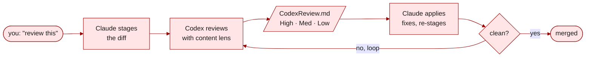

# implement-review

Structured dual-agent review loop that sends staged changes to a reviewer agent (e.g., Codex) and iterates until findings are resolved. Content-type-aware lenses apply established review criteria from the Google / Microsoft engineering playbooks (code), NeurIPS / ICLR / ICML / ACL guidelines (papers), and the NSF Merit Review / NIH Simplified Peer Review frameworks (proposals).


