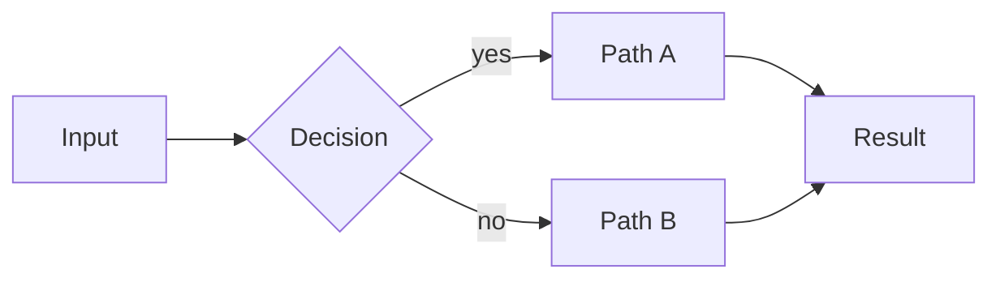
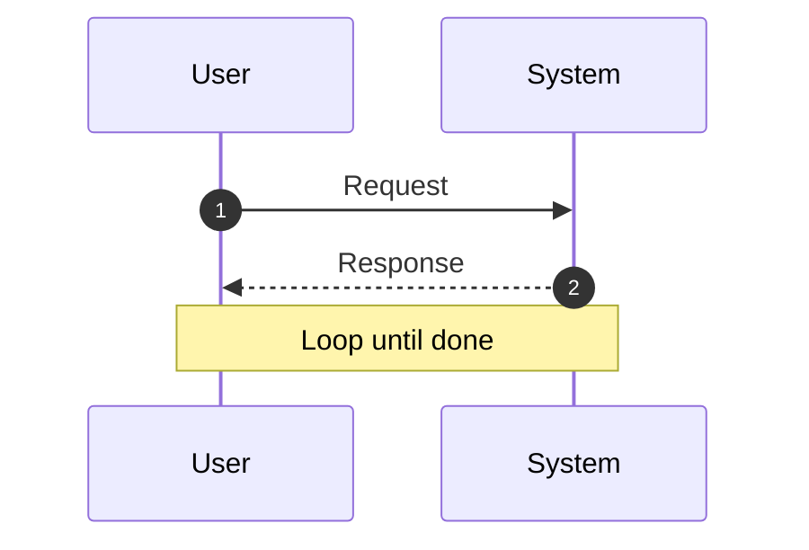

# Modern README Patterns — copyable snippets

All snippets target GitHub's Flavored Markdown renderer (the only one that matters for OSS READMEs). Many will not render correctly in PyCharm / VS Code preview; always verify on GitHub.

## Centered header with dot-nav

```markdown
<a id="readme-top"></a>

<div align="center">

# project-name

**One-line tagline that survives on its own.**

Short elevator pitch — one or two sentences.

[](https://pypi.org/project/project-name/)
[](LICENSE)
[](https://github.com/owner/project-name/actions/workflows/validate.yml)

[Install](#install) &nbsp;•&nbsp;
[Features](#features) &nbsp;•&nbsp;
[Docs](#docs)

</div>
```

Notes:
- `<a id="readme-top"></a>` gives a stable anchor for the "back to top" link.
- Keep the tagline under 15 words. If it is longer, it is a paragraph, not a tagline.
- Customize badge color via the `?color=` query (hex, no `#`). Match the project brand if you have one.

## Badges (Shield.io)

Common ones, in recommended order:

```markdown
[](https://pypi.org/project/<pkg>/)
[](https://www.npmjs.com/package/<pkg>)
[](LICENSE)
[](https://github.com/<owner>/<repo>/actions/workflows/<file>.yml)
[](https://github.com/<owner>/<repo>)
[](https://pypi.org/project/<pkg>/)
```

Do not exceed 5-6. More becomes visual noise.

## Hero image

### Single PNG (simplest)

```markdown

```

Generate from an HTML mockup via headless Chrome (see `ci-mockup-figure` skill). Always commit the source HTML alongside the PNG so regeneration is reproducible.

### Light/dark pair via `<picture>`

```markdown
<p align="center">
  <picture>
    <source media="(prefers-color-scheme: dark)"  srcset="docs/logo-dark.svg">
    <source media="(prefers-color-scheme: light)" srcset="docs/logo-light.svg">
    
  </picture>
</p>
```

Use when the project has a distinct logo/wordmark that reads differently on light and dark backgrounds. For most mid-size OSS projects, a single PNG is fine.

## GitHub alert callouts

Syntax: `> [!NOTE]` / `[!TIP]` / `[!WARNING]` / `[!CAUTION]` / `[!IMPORTANT]` as the **first line** of the blockquote, alone on that line.

```markdown
> [!NOTE]
> Maintained by [Name](https://link) — two-sentence credentials paragraph. Verifiable claims only: package stars, download counts, citation counts, institutional affiliation.

> [!TIP]
> The simplest install is to tell your AI agent: _"Install <pkg> in this project."_

> [!WARNING]
> Breaking change in v2.0: the default behavior of X changed to Y. Pin to v1.x if you need the old behavior.
```

Rules:
- Only one per major section. If every paragraph is a callout, none of them are.
- The first source line must be exactly `> [!NAME]` — one blockquote marker, one alert tag, alone on that line. No indentation, no extra blockquote prefix before the marker.
- Renders as a colored box with an icon on GitHub only. PyCharm / VS Code default previews show it as a plain blockquote.

## Emoji-prefixed feature bullets

```markdown
## What you get

- 🛡️ **Loud safety** — destructive commands hit a loud warning block. Read-only ops stay silent.
- 🔄 **Dual-agent review** — implementer + gatekeeper with independent judgment.
- ✍️ **Consistent writing style** — 40+ AI-tell words banned; format preserved.
- 🧭 **Auto dispatch** — router picks the right skill from prompt + file type.
- 🔒 **Git safety** — commit/push/reset always confirm; read-only ops stay fast.
```

Each bullet = one emoji + **bold feature name** + em-dash + one-line takeaway. Aim for 5–8 bullets. Fewer than 4 feels thin; more than 8 becomes a wall.

Do not use emoji on section headings (`## 🚀 Quickstart` reads as noise). Reserve emoji for the feature-bullet line.

## Tables instead of bullets

For reference content (comparisons, scenario → action, decision matrices), tables beat bullets:

```markdown
| Scenario | Do this |
|----------|---------|
| Add to a new project | Run `pipx run project-name` in project root |
| Get latest updates | Start a new session — bootstrap runs automatically |
| Force refresh | `bash .agent-config/bootstrap.sh` |
```

Compare to the bullet equivalent:

```markdown
- **Add to a new project:** Run `pipx run project-name` in the project root.
- **Get latest updates:** Start a new session — bootstrap runs automatically.
- **Force refresh:** Run `bash .agent-config/bootstrap.sh`.
```

The table version is denser, reads faster, and scales to 10+ rows without becoming a wall.

Use bullets when entries are prose-shaped (philosophy, principles). Use tables when entries are symmetric facts.

## Collapsible details

````markdown
<details>
<summary><b>Platform-specific install</b> (macOS / Linux / Windows)</summary>

macOS / Linux:

```bash
curl -sfL https://example.com/install.sh | bash
```

Windows (PowerShell):

```powershell
iwr https://example.com/install.ps1 | iex
```

</details>
````

When to collapse:
- Platform-specific variants of a command
- "Related projects" / "Alternatives"
- "Limitations and caveats"
- Repo layout / file tree
- "What this is not"
- FAQ
- Maintenance policy / contribution scope

When NOT to collapse:
- The primary install command
- The tagline or elevator pitch
- "What you get" bullets
- Required reading (license mention, prereqs)

## Mermaid diagrams

Flowchart (layout, architecture, decision tree):

~~~markdown

~~~

Sequence diagram (protocol, interaction, workflow):

~~~markdown

~~~

Renders natively on GitHub. Colors via `classDef` are stable; complex styling is fragile. Do not use for hero images — a rendered PNG has more visual weight.

## Back-to-top anchor

Place at the top:

```markdown
<a id="readme-top"></a>
```

And at the end of each major section (or just the bottom):

```markdown
<div align="center">

<a href="#readme-top">↑ back to top</a>

</div>
```

Worth it only for READMEs over ~150 lines. Shorter READMEs, skip it.

## Install paths (multi-ecosystem)

If the project has PyPI, npm, and raw-shell install options:

````markdown
## Install

> [!TIP]
> The simplest install is to tell your AI agent: _"Install <pkg> in this project."_

```bash
# Python (zero-install if you have pipx)
pipx run <pkg>

# Node.js (zero-install if you have Node 14+)
npx <pkg>
```

<details>
<summary><b>Raw shell (no package manager required)</b></summary>

macOS / Linux:

```bash
mkdir -p .dirname
curl -sfL https://example.com/install.sh -o .dirname/install.sh
bash .dirname/install.sh
```

Windows (PowerShell):

```powershell
New-Item -ItemType Directory -Force -Path .dirname | Out-Null
Invoke-WebRequest -UseBasicParsing -Uri https://example.com/install.ps1 -OutFile .dirname/install.ps1
& .\.dirname\install.ps1
```

</details>
````

Why this structure:
- Primary install commands are immediately visible (no scrolling, no expanding).
- Raw shell variants are collapsed because they are platform-specific (avoids making Windows users scroll past the macOS command or vice versa).
- The `> [!TIP]` callout tells agent-literate users the fastest path.

## Shell blocks inside markdown cells

Markdown tables do not support multi-line code blocks in cells. If you need to show a command inside a table row, keep it inline:

```markdown
| Scenario | Command |
|----------|---------|
| Python install | `pipx run <pkg>` |
| Node install | `npx <pkg>` |
```

For longer commands, link out of the table to a code block below, or use a different structure (bullets or collapsible).

## Avoiding common pitfalls

### Credentials in a blockquote, not a paragraph

```markdown
> [!NOTE]
> Maintained by [Name](https://link) — Role at Org, author of [Project](https://link) (X stars, Y downloads). Short pitch for why the reader should trust this setup.
```

Never a 100-word paragraph as the first thing after the tagline. That delays the install path.

### Alt text on hero images

```markdown

```

Screen readers, SEO, and the rendered fallback all benefit from descriptive alt text. "hero" alone is not descriptive.

### Anchor links match autogenerated slugs

GitHub autogenerates heading anchors:
- Lowercase everything
- Replace spaces with hyphens
- Strip most punctuation (parens, colons, question marks)
- Keep periods and underscores

Examples:
- `## What you get after setup (5 minutes)` → `#what-you-get-after-setup-5-minutes`
- `## Fork and customize (make it yours)` → `#fork-and-customize-make-it-yours`
- `## The agentic workflow this encodes` → `#the-agentic-workflow-this-encodes`

Always verify anchor links after a rewrite. Easiest way: push to a branch, view on GitHub, click each link.
